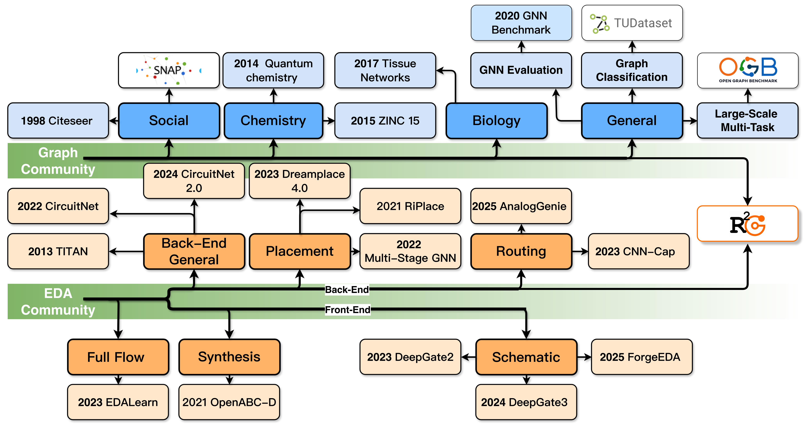
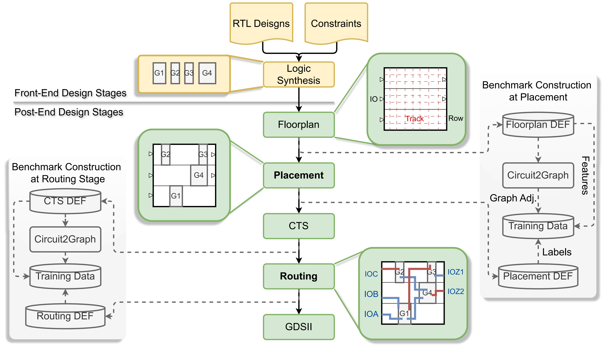

# R2G: A Multi-View Circuit Graph Benchmark Suite from RTL to GDSII

[](https://cvf.openaccess.thewebconference.com/content/CVPR2026)
[](LICENSE)

R2G is a standardized benchmark and framework that converts DEF files into typed, heterogeneous, information-preserving circuit graphs and supports node- and edge-level tasks in placement and routing. It distinguishes itself by:

- **Multi-View Representations**: 5 stage-aware views with information parity
- **Typed Heterogeneity**: Distinguishes different node/edge types (gates, nets, pins, IOs)
- **Stage-Aware Supervision**: Supports placement (HPWL) and routing (wire_length, via_count) tasks
- **Standardized Splits**: Unified train/val/test splits across designs

This enables fair cross-view comparison and isolates representation from modeling for EDA machine learning.

---

## Key Features

- **DEF to Graph Conversion**: Converts physical design files into standardized multi-view circuit graphs
- **PyTorch Geometric Integration**: Full support for PyTorch Geometric data format
- **Multiple GNN Architectures**: GINE, GAT, ResGatedGCN implementations
- **Performance Metrics Analysis**: Evaluates HPWL for placement, wire length and via count for routing
- **Extensible Design**: Active development with plans for additional tasks and models

---

## Table of Contents

- [Overview](#overview)
- [Installation](#installation)
- [Usage Examples](#usage-examples)
- [Project Structure](#project-structure)
- [Data Generation Pipeline](#data-generation-pipeline)
- [Training & Evaluation](#training--evaluation)
- [Citation](#citation)

---

## Overview

### What is R2G?

R2G converts physical design files (DEF) from the OpenROAD EDA flow into standardized multi-view circuit graphs suitable for graph neural network training. The benchmark suite consists of two phases:

- **Phase 1 (Data Generation)**: DEF → Multi-view Graphs → Merged Homographs → .pt files
- **Phase 2 (Model Training)**: .pt files → GNN Training → Model Evaluation

### Design Corpus

R2G is built on open-source IP cores from OpenCores and GitHub, spanning multiple categories:

| Category | Examples | Characteristics |
|----------|----------|-----------------|
| **Video/Audio** | vga_lcd, ac97_ctrl | Structured dataflow with moderate pin counts |
| **Communication** | uart, spi, pci, usb | Protocol-centric controllers with high external connectivity |
| **Crypto** | des3, aes, sha256 | Dense combinational logic with pipeline stages |
| **DSP** | fir, jpeg, idft | Arithmetic throughput and wide datapaths |
| **Processors** | tv80, riscv32i, ibex, swerv | Largest scales with mixed control–datapath structure |

**Scale Statistics** (representative designs):
- **Gates**: 463 to 158,629 cells
- **Nets**: 521 to 178,202 connections
- **IOs**: 28 to 2,546 pins

### Why R2G?



Current graph ML benchmarks (OGB, TUDataset) are domain-agnostic and don't capture EDA-specific semantics:
- **Typed heterogeneity**: Different node/edge types (gates, nets, pins, IOs)
- **Multi-terminal connectivity**: Nets connect multiple pins
- **Geometry-aware attributes**: Coordinates, layers, areas
- **Stage-aware supervision**: Different labels at different design stages

R2G fills this gap by providing a stage-aware, multi-view circuit-graph benchmark suite at the intersection of graph ML and EDA, as shown above.

---

## Installation

Create a conda environment and install dependencies:

```bash
# Create conda environment
conda create -n gnn_env python=3.10 -y
conda activate gnn_env

# Install PyTorch with CUDA 12.1 support
pip install torch torchvision torchaudio --index-url https://download.pytorch.org/whl/cu121

# Install PyTorch Geometric
pip install torch-geometric
pip install pyg-lib torch-scatter torch-sparse torch-cluster torch-spline-conv -f https://data.pyg.org/whl/torch-2.5.0+cu121.html

# Install other dependencies
pip install -r requirements.txt
```

**Note**: CUDA 12.1 is recommended for GPU acceleration. Verify with `nvidia-smi`.

---

## Usage Examples

### 0. Environment Setup

Ensure CUDA 11.0+ is installed. Verify with `nvidia-smi`.

### 1. Data Generation Pipeline

**Step 1: Prepare DEF Files**

Place your DEF files in the appropriate directories:
- Placement DEF files: `data_sources/placement_def/<design_name>/floorplan.def`
- Routing DEF files: `data_sources/routing_def/<design_name>/floorplan.def`

The generation modules for different graph views are located at `data_pipeline/heterograph_generation/`.

**Step 2: Generate Heterographs**

Generate heterographs for a specific view (View B - recommended for best performance):

```bash
# Placement task, View B
python data_pipeline/heterograph_generation/placement_v1.4/B_heterograph_generator.py \
    --input_dir data_sources/placement_def \
    --output_dir data/heterographs/place

# Routing task, View B
python data_pipeline/heterograph_generation/routing_v1.3/RB_heterograph_generator.py \
    --input_dir data_sources/routing_def \
    --output_dir data/heterographs/route
```

**Step 3: Convert to Homographs**

```bash
# Placement
python data_pipeline/homograph_conversion/placement_v1.4/place_hetero_to_homo_converter.py \
    --input_dir data/heterographs/place \
    --output_dir data/homographs/place

# Routing
python data_pipeline/homograph_conversion/routing_v1.3/route_hetero_to_homo_converter.py \
    --input_dir data/heterographs/route \
    --output_dir data/homographs/route
```

**Step 4: Merge Homographs**

Merge graphs from multiple designs into a single training dataset:

```bash
# Placement - merge nodes first, then edges
python data_pipeline/graph_merging/placement_homo/node_merge_homographs.py \
    --input_dir data/homographs/place \
    --output_file data/merged/place_B_homograph.pt

python data_pipeline/graph_merging/placement_homo/edge_merge_homographs.py \
    --input_dir data/homographs/place \
    --output_file data/merged/place_B_homograph.pt

# Routing
python data_pipeline/graph_merging/routing_homo/node_merge_homographs.py \
    --input_dir data/homographs/route \
    --output_file data/merged/route_B_homograph.pt

python data_pipeline/graph_merging/routing_homo/edge_merge_homographs.py \
    --input_dir data/homographs/route \
    --output_file data/merged/route_B_homograph.pt
```

**Results**: The merged `.pt` files contain complete datasets ready for GNN training.

### 2. Model Training

**Node-Level Task Example (Placement HPWL Prediction)**

Navigate to the training directory and run:

```bash
cd gnn-node

# Best configuration (R² > 0.99)
python main.py \
    --dataset place_B_homograph \
    --task_level node \
    --task regression \
    --model gine \
    --num_gnn_layers 4 \
    --num_head_layers 4 \
    --hid_dim 256 \
    --lr 0.0001 \
    --lr_scheduler plateau \
    --epochs 100 \
    --gpu 0 \
    --fixed_test_ids "2,9,21,27,28" \
    --fixed_val_ids "5,14,1,24,26"
```

**Edge-Level Task Example (Routing Wire Length Prediction)**

```bash
cd gnn-edge

# Best configuration (R² > 0.99)
python main.py \
    --dataset route_E_homograph \
    --task_level edge \
    --task regression \
    --model gat \
    --num_gnn_layers 3 \
    --num_head_layers 4 \
    --hid_dim 256 \
    --lr 0.0001 \
    --epochs 100 \
    --gpu 0
```

**Available Models**:
- `gine` - Graph Isomorphism Network (best overall performance on View B)
- `resgatedgcn` - Residual Gated Graph Convolution (most stable across views)
- `gat` - Graph Attention Network (excels on View E)

### 3. Results Analysis

After training completes, results are saved to:

```
results/<dataset>_<model>_head<hid>_hid<hidden>_layers<layers>_scheduler<scheduler>/
├── train.log                    # Full training log
├── best_model.pt                # Best model weights
├── test_results.npz             # Test predictions & labels
├── train_eval.npz              # Train evaluation
├── val_eval.npz                # Validation evaluation
├── label_distribution.png     # Label distribution plots
└── plots_*/                     # Scatter plots
    ├── train_scatter.png
    ├── val_scatter.png
    └── test_scatter.png
```

To load and analyze results:

```python
import numpy as np
import matplotlib.pyplot as plt

# Load test results
data = np.load('results/.../test_results.npz')
preds = data['preds']
labels = data['labels']

# Compute metrics
mae = np.mean(np.abs(labels - preds))
rmse = np.sqrt(np.mean((labels - preds) ** 2))
r2 = 1 - np.sum((labels - preds) ** 2) / np.sum((labels - labels.mean()) ** 2)

print(f"MAE: {mae:.4f}, RMSE: {rmse:.4f}, R²: {r2:.4f}")
```

---

## Project Structure

```
R2G/
├── README.md                       # This file
├── LICENSE                         # MIT License
├── requirements.txt                # Python dependencies
├── EDA_Data_Extractor.py          # EDA data extraction tool
├── figs/                          # Figures and diagrams
│   ├── prefect_intro.png          # Dataset evolution diagram
│   └── pipeline_overview.png      # Data generation pipeline
├── data_pipeline/                  # Data generation pipeline
│   ├── heterograph_generation/     # Heterograph generation (Views B-F)
│   │   ├── placement_v1.4/        # Placement heterographs
│   │   │   ├── B_heterograph_generator.py
│   │   │   ├── C_heterograph_generator.py
│   │   │   ├── D_heterograph_generator.py
│   │   │   ├── E_heterograph_generator.py
│   │   │   └── F_heterograph_generator.py
│   │   └── routing_v1.3/         # Routing heterographs
│   │       ├── RB_heterograph_generator.py
│   │       ├── RC_heterograph_generator.py
│   │       ├── RD_heterograph_generator.py
│   │       ├── RE_heterograph_generator.py
│   │       └── RF_heterograph_generator.py
│   ├── homograph_conversion/      # Heterograph → Homograph conversion
│   │   ├── placement_v1.4/
│   │   │   └── place_hetero_to_homo_converter.py
│   │   └── routing_v1.3/
│   │       └── route_hetero_to_homo_converter.py
│   ├── graph_validation/          # Graph quality checks
│   │   ├── check_heterograph.py   # Validate heterographs
│   │   ├── check_homographs.py    # Validate homographs
│   │   └── compare_graphs.py      # Compare graph views
│   └── graph_merging/             # Graph merging across designs
│       ├── placement_homo/
│       │   ├── instruction.txt               # Usage instructions
│       │   ├── node_merge_homographs.py
│       │   └── edge_merge_homographs.py
│       └── routing_homo/
│           ├── instruction.txt
│           ├── node_merge_homographs.py
│           └── edge_merge_homographs.py
├── data_sources/                  # Raw data sources
│   ├── placement_def/            # Placement DEF files
│   └── routing_def/              # Routing DEF files
├── gnn-node/                     # Node-level task training
│   ├── main.py                   # Entry point (task_level=node)
│   ├── model.py                  # GNN models
│   ├── dataset.py                # Data loading
│   ├── encoders.py               # Feature encoding
│   ├── sampling.py               # Neighbor sampling
│   └── downstream_train.py       # Training loop
└── gnn-edge/                     # Edge-level task training
    ├── main.py                   # Entry point (task_level=edge)
    ├── model.py
    ├── dataset.py
    ├── encoders.py
    ├── sampling.py
    └── downstream_train.py       # Training loop
```

---

## Data Generation Pipeline



The data generation pipeline converts DEF files into multi-view circuit graphs through a four-stage process:

### Pipeline Overview

```
DEF Files (OpenROAD)
        │
        ├─ design1/floorplan.def
        ├─ design2/floorplan.def
        └─ design3/floorplan.def
        │
        ↓ (Heterograph Generation)
        │
   Heterographs (Typed)
        │
        ├─ design1_B_heterograph.pt  ──┐
        ├─ design2_B_heterograph.pt  ──┼─ View B (Recommended)
        ├─ design3_B_heterograph.pt  ──┘
        │
        ↓ (Homograph Conversion)
        │
   Homographs (Unified)
        │
        ├─ design1_B_homograph.pt
        ├─ design2_B_homograph.pt
        └─ design3_B_homograph.pt
        │
        ↓ (Graph Merging)
        │
   Merged Dataset
        │
        └─ place_B_homograph.pt  (Ready for training)
```

### Multi-View Graph Representations

R2G provides 5 complementary views of circuit graphs:

| View | Nodes | Edges | Best For |
|------|-------|-------|----------|
| **(b)** All Elements as Nodes | Gates + Nets + Pins + IOs | All Connections | **Overall Performance** |
| **(c)** Pins as Edges | Gates + Nets + IOs | Gate-Net (pins as edges) | Signal-aware learning |
| **(d)** Nets as Edges | Gates + IOs | Gate↔Gate (nets as edges) | Pairwise connectivity |
| **(e)** Net-Gate Incidence | Gates + Nets | Gate↔Net (incidence edges) | Bipartite formulation |
| **(f)** Nets Without Pins | Gates + Nets + IOs | Gate↔Net (pruned pins) | Scalability |

**Recommendation**: View (b) achieves the best overall performance for both placement and routing tasks.

### Node Types & Features

| Type | ID | Features |
|------|----|----------|
| gate | 0 | x, y, cell_type, orientation, area, place_flag, power_leak |
| io_pin | 1 | x, y, io_x, io_y |
| net | 2 | net_type, pin_count |
| pin | 3 | x, y, pin_type, owning_gate_type |

### Labels

**Placement Labels (HPWL Prediction)**:
- Target: HPWL (Half-Perimeter Wire Length)
- Formula: `HPWL = (x_max - x_min) + (y_max - y_min)`
- Computed from: Minimal bounding box over a net's pins
- Stored in: Node labels for net nodes (views b/c) or edge labels (views d-f)

**Routing Labels (Wire Length & Via Count)**:
- Target 1: wire_length (Total routed wire length)
- Formula: `wire_length = Σ_ℓ Σ_(x1,y1),(x2,y2)∈ℓ |x2-x1| + |y2-y1|`
- Target 2: via_count (Number of vias used)
- Computed from: DEF routed geometry per metal layer
- Stored in: Node labels for net nodes (views b/c) or edge labels (views d-f)

---

## Training & Evaluation

### Training Architecture

```
┌─────────────────────────────────────────────────────────────┐
│                    Training Pipeline                        │
└─────────────────────────────────────────────────────────────┘
                          │
                          ↓
┌─────────────────────────────────────────────────────────────┐
│  1. Data Loading & Preprocessing                           │
│     ├─ Load .pt files                                       │
│     ├─ Split train/val/test by graph_id                    │
│     ├─ Normalize labels (log + z-score)                   │
│     ├─ Concatenate global features                         │
│     └─ Create valid_mask                                    │
└─────────────────────────────────────────────────────────────┘
                          │
                          ↓
┌─────────────────────────────────────────────────────────────┐
│  2. Feature Encoding                                        │
│     └─ Discrete → Embedding, Continuous → Linear            │
└─────────────────────────────────────────────────────────────┘
                          │
                          ↓
┌─────────────────────────────────────────────────────────────┐
│  3. GNN Message Passing (3-4 layers)                        │
│     ├─ GINE: MLP-based aggregation                          │
│     ├─ ResGatedGCN: Gated residual connections             │
│     └─ GAT: Attention-weighted aggregation                  │
└─────────────────────────────────────────────────────────────┘
                          │
                          ↓
┌─────────────────────────────────────────────────────────────┐
│  4. Task-Specific Head (3-4 layers)                         │
│     ├─ Node: head(node_embedding)                           │
│     └─ Edge: agg(src,dst,edge) → head()                     │
└─────────────────────────────────────────────────────────────┘
                          │
                          ↓
┌─────────────────────────────────────────────────────────────┐
│  5. Training & Evaluation                                   │
│     ├─ SmoothL1Loss (regression)                           │
│     ├─ Learning rate scheduling                             │
│     └─ MAE, RMSE, R² metrics                                │
└─────────────────────────────────────────────────────────────┘
```

### Supported GNN Models

| Model | Mechanism | Best View | Characteristics |
|-------|-----------|-----------|-----------------|
| **GINE** | MLP-based aggregation with edge features | View (b) | Theoretically optimal for isomorphism tasks |
| **ResGatedGCN** | Residual gated graph convolutions | View (b,c) | Most stable across views, preserves geometric coupling |
| **GAT** | Attention-weighted aggregation | View (e) | Excels on incidence-edge neighborhoods with rich local connectivity |

### Evaluation Metrics

**Regression** (Placement/Routing):
- **MAE** (Mean Absolute Error): `mean(|y_true - y_pred|)`
- **RMSE** (Root Mean Squared Error): `sqrt(mean((y_true - y_pred)²))`
- **R²** (Coefficient of Determination): `1 - SS_res / SS_tot`

---

## Citation

If you use R2G in your research, please cite:

```bibtex
@inproceedings{r2g2026,
  title={R2G: A Multi-View Circuit Graph Benchmark Suite from RTL to GDSII},
  author={First Author and Second Author},
  booktitle={Proceedings of the IEEE/CVF Conference on Computer Vision and Pattern Recognition (CVPR)},
  year={2026}
}
```

---

## Acknowledgments

- **OpenROAD** for providing the open-source physical design flow
- **PyTorch Geometric** for the graph neural network framework
- **Open Graph Benchmark (OGB)** for inspiring the benchmark design
- **TUDataset** for consolidated graph collections best practices

---

## License

This project is licensed under the MIT License - see the [LICENSE](LICENSE) file for details.

---

## Future Development

Planned enhancements include:
- Expanded designs and technology coverage
- Timing- and congestion-aware tasks with richer LEF/STA/PDN attributes
- Exploration of deeper GNNs, transformers, and MoE architectures
- Cross-design and cross-node generalization studies
- Stronger standardized evaluation for EDA

---

## Contributing

Contributions are welcome! Please feel free to open issues and pull requests.
